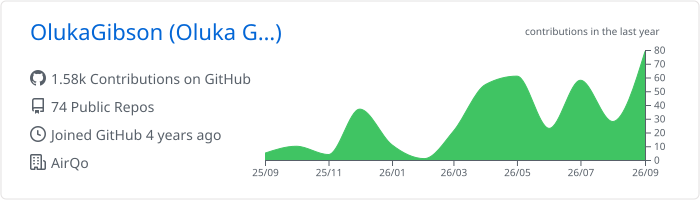
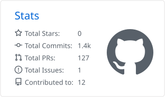
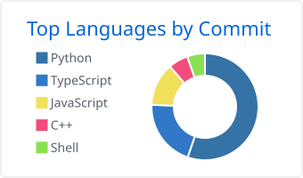

# Hi, I'm Gibson Oluka 👋🏾

---

## About me

I'm a software engineer in Uganda with 3+ years across full-stack web, data & AI, DevOps and embedded systems. I do my best work where hardware meets software: designing PCBs, writing ESP32 firmware, and building the APIs and dashboards that manage the devices.

- 🌍 **At [AirQo](https://airqo.net)** I build tools for running a network of air-quality sensors: **Vertex** (device fleet management) and **Beacon** (device health & diagnostics), plus the APIs behind them. **100+ merged PRs** across [AirQo-frontend](https://github.com/airqo-platform/AirQo-frontend), [AirQo-api](https://github.com/airqo-platform/AirQo-api) and [AirQo-hardware](https://github.com/airqo-platform/AirQo-hardware).
- 📦 Author of [`airqloudanalysis`](https://pypi.org/project/airqloudanalysis/) on PyPI, for sensor-health, uptime and data-completeness analysis across device fleets.
- 🤖 Latest side project: running **local LLMs on edge hardware**, an offline air-quality assistant on a Raspberry Pi.
- 🤝 Open to **backend, data or embedded systems** roles and collaborations. [Let's connect](https://www.linkedin.com/in/olukagibson/).

## Featured projects

| Project | What it does | Built with |
| --- | --- | --- |
| 🌬️ **[Air Quality Edge Assistant](https://github.com/OlukaGibson/airqo-edge-agent)** | Offline AI assistant for air-quality data. Runs a local Gemma model through Ollama on a Raspberry Pi 4, with a YAML-driven tool registry for pulling in external data. | Python · FastAPI · Ollama · SQLite · Docker |
| 📡 **IoT Hub** [API](https://github.com/OlukaGibson/iothubFastAPI) · [Web](https://github.com/OlukaGibson/iothub-frontend) · [Live](https://iothub-frontend.vercel.app) | Device-management platform for organisations: device registration and config, data ingestion, firmware storage on Google Cloud Storage, users and roles. | FastAPI · SQLAlchemy · PostgreSQL · React · TypeScript · Tailwind |
| 📊 **[airqloudanalysis](https://github.com/OlukaGibson/deviceAnalysisLibrary)** | Python library for AirQo device fleets: sensor health, uptime, data completeness and battery performance. `pip install airqloudanalysis` | Python · pandas |
| 💡 **HMZ Lighting** [Firmware](https://github.com/OlukaGibson/hmz-lighting-IoT) · [App](https://github.com/OlukaGibson/hmz-lighting-mobile) | ESP32-S3 controller for WS2812B/SK6812 LED strips over BLE, plus a Flutter app that drives up to 4 controllers at once with saved themes. | C++ · PlatformIO · BLE · Flutter |
| 🏠 **[Indoor Air Quality Monitor](https://github.com/OlukaGibson/indoorAirQualityMonitoringSystem)** | ESP32 monitor that shows live PM2.5 readings on an on-device LVGL display. | ESP32 · ESPHome · LVGL |

**More:** [Property Management](https://property-management-frontend-nu.vercel.app/) · [Rocque Advisory website](https://rocque-advisory-website.vercel.app) · [LeetCode solutions (C++)](https://github.com/OlukaGibson/leetcodechallenges)

## Tech stack

  

Also: SQLAlchemy · Alembic · Ollama & LLM agents · Keras · PlatformIO · ESPHome · LVGL · BLE · KiCad (PCB design)

## Education & certifications

- 🎓 **BSc Software Engineering**, Makerere University (2020–2024)
- 📜 **Coursera (2023):** Machine Learning with Python · Deep Learning & Neural Networks with Keras · Generative AI using LLMs · Computer Vision & Image Processing

## GitHub activity

<picture>
  <source media="(prefers-color-scheme: dark)" srcset="https://streak-stats.demolab.com/?user=OlukaGibson&theme=github-dark-blue&hide_border=true" />
  
</picture>

<picture>
  <source media="(prefers-color-scheme: dark)" srcset="./profile-summary-card-output/github_dark/0-profile-details.svg" />
  
</picture>

<picture>
  <source media="(prefers-color-scheme: dark)" srcset="./profile-summary-card-output/github_dark/3-stats.svg" />
  
</picture>
<picture>
  <source media="(prefers-color-scheme: dark)" srcset="./profile-summary-card-output/github_dark/2-most-commit-language.svg" />
  
</picture>

<!-- Contribution snake: uncomment once the "Update profile cards" workflow has run and created the output branch.
<picture>
  <source media="(prefers-color-scheme: dark)" srcset="https://raw.githubusercontent.com/OlukaGibson/OlukaGibson/output/github-snake-dark.svg" />
  
</picture>
-->

Cards are regenerated daily by a GitHub Action in this repo.

